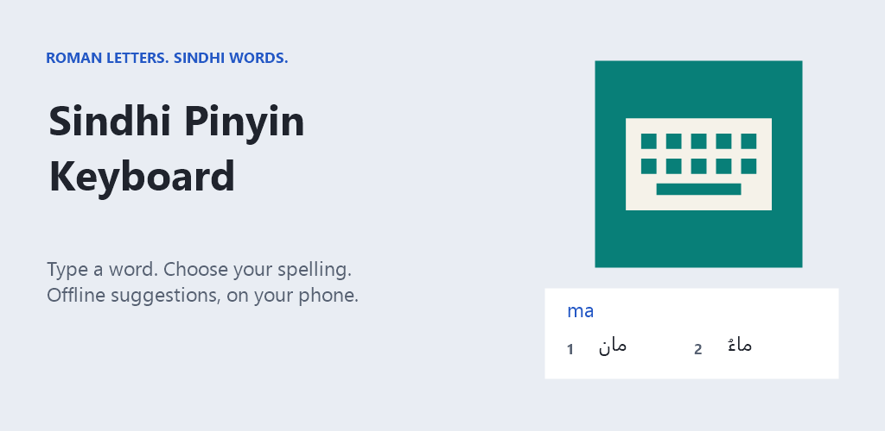
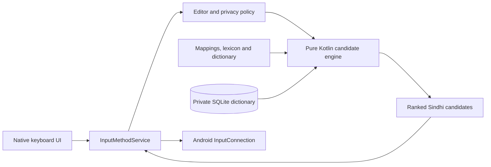

# Sindhi Pinyin Keyboard

**Roman letters. Sindhi words. Offline, on your phone.**




An offline Android keyboard that converts Roman Sindhi into Sindhi Perso-Arabic script. Built with Kotlin, a native `InputMethodService`, a separate JVM candidate engine, and local SQLite storage. It explores practical text input for an under-served language without sending typing to a server.

**Project status:** working research alpha, not a published Google Play release. Language mappings and prediction quality still need independent native-speaker evaluation. The image above is a project illustration, not a device screenshot.

## What it does

- **Roman Sindhi input:** ranked words, phonetic dictionary alternatives, character conversion, prefix completions, and explicit typo suggestions.
- **Visible choices:** numbered, right-to-left candidate tiles; Space accepts the displayed default. Longer completions and corrections require selection.
- **Conversation assistance:** bounded phrase lookup and same-session context, including suffix completion without repeating words already committed.
- **Three input modes:** Roman Sindhi, direct Sindhi script with diacritics, and English with basic offline spelling and completion assistance.
- **Personal dictionary:** manual words and phrases, plus optional local frequency learning that starts disabled; inspection and deletion controls.
- **Native Android integration:** composing text, editor actions, keyboard switching, light/dark themes, sound/haptic options, and a setup/practice screen.
- **Offline privacy:** no Internet permission, advertising SDK, analytics, microphone access, or raw keystroke log. Sensitive fields suppress suggestions and learning; backup and device transfer are excluded.

## Try it

Build the development APK using the steps below, then install it on Android 7.0 or newer:

```sh
adb install -r app/build/outputs/apk/debug/app-debug.apk
```

Open **Sindhi Pinyin Keyboard**, tap **Enable**, then **Choose your keyboard**. Select Roman Sindhi and everyday spellings. Try these in the practice field:

| Roman input | Example Sindhi output |
| --- | --- |
| `sindhi` | سنڌي |
| `sindh` | سنڌ |
| `kitab` | ڪتاب |
| `twan jo nalo sha ahe` | توهان جو نالو ڇا آهي |

Type one word at a time and use Space or tap a numbered candidate. The marked candidate shows what Space will commit. These are regression examples, not proof of accuracy on unseen text. Tap **SD / سنڌي / EN** to cycle modes; the globe opens Android's keyboard picker.

Android displays a standard warning when enabling a third-party keyboard. A fresh machine or CI run may use a different debug signing key; Android cannot install it over a differently signed build. Back up any manually entered dictionary data before uninstalling an old build, since uninstalling erases local app data.

## Build and verify

Install **JDK 21** (the verified runtime), **Android SDK Platform 36**, and **Build Tools 36.0.0**. Open the project in Android Studio, or set `ANDROID_HOME` to your SDK. Alternatively create an untracked `local.properties` with `sdk.dir` pointing to the SDK.

The Gradle wrapper pins **Gradle 9.6.0** with a distribution checksum. The build uses **Android Gradle Plugin 9.4.0**, built-in Android Kotlin support, and **Kotlin JVM 2.2.10** for the engine. Initial dependency resolution needs Internet access; the installed keyboard does not.

```sh
# macOS / Linux
./gradlew :engine:test :app:testDebugUnitTest :app:lintDebug :app:assembleDebug :app:assembleDebugAndroidTest

# With a connected device or emulator
./gradlew :app:connectedDebugAndroidTest
```

```powershell
# Windows PowerShell
.\gradlew.bat :engine:test :app:testDebugUnitTest :app:lintDebug :app:assembleDebug :app:assembleDebugAndroidTest
```

The APK is written to `app/build/outputs/apk/debug/app-debug.apk`. The optional Windows helper `scripts/build-test-apk.ps1` uses the same Gradle build, copies the APK to `dist/`, and records its SHA-256 checksum. Debug signing uses Android's default debug key on a fresh checkout; an existing `.tools/debug.keystore` is preserved for local update compatibility. Never commit signing keys.

The repository includes a [GitHub Actions workflow](.github/workflows/android.yml) for unit tests, lint, APK compilation, and downloadable reports/development APKs. Instrumentation tests are compiled by CI but require a device or emulator to execute.

**SDK caveat:** the current project compiles against API 36, targets API 37, and supports API 24+. It uses no API 37-only calls. Align the compilation platform and validate target-platform behavior before a production release; do not interpret a successful build as release certification.

## Verification

Fresh local verification on **1 October 2026**:

| Check | Result |
| --- | --- |
| Engine unit tests | 36 passed |
| Android app JVM tests | 10 passed |
| Debug APK | Built successfully |
| Android instrumentation APK | Compiled; device execution not performed |
| Android lint | 0 errors, 9 warnings |

See [current verification](docs/PORTFOLIO_VERIFICATION.md), the [device test plan](docs/TEST_PLAN.md), and [historical build reports](docs/BUILD_REPORT.md). CI results become available after the repository is pushed and the workflow runs.

## How it is built



| Path | Responsibility |
| --- | --- |
| `app/src/main/java/org/sindhipinyin/keyboard/ime/` | Keyboard views, IME lifecycle, field policy, composition, and commits |
| `app/src/main/java/org/sindhipinyin/keyboard/data/` | Preferences, local dictionary, and mapping persistence |
| `app/src/main/java/org/sindhipinyin/keyboard/MainActivity.kt` | Setup, practice, guide, dictionary, and settings |
| `engine/src/main/kotlin/` | Transliteration, phonetic retrieval, ranking, and conversation/English assistance |
| `engine/src/main/resources/` | Editable UTF-8 mappings, seed data, and licensed script dictionary |
| `engine/src/test/`, `app/src/test/` | JVM regression tests |
| `app/src/androidTest/` | Device-based input, privacy-policy, and candidate-view tests |

The phonetic dictionary uses a consonant-based index to narrow retrieval rather than scanning every dictionary entry on each key. Session/query identities prevent delayed results from crossing editor sessions. Composition rules keep the candidate shown to the user consistent with what Space commits. These choices are discussed in the [architecture notes](docs/ARCHITECTURE.md) and version updates below.

## Scope and limitations

This is a deterministic retrieval system, not a generative language model. The bundled 10,000+ entry script dictionary does not provide verified Roman pronunciations. Seed weights, aliases, and phrase rankings are authored heuristics; scholarly mode is a draft convention, not a certified ALA–LC implementation. English assistance is a starter vocabulary. Device/editor compatibility, accessibility, performance, and held-out linguistic accuracy still need measured evaluation.

[0.2 input and dictionary changes](docs/UPDATE-0.2.md) · [0.3 conversation changes](docs/UPDATE-0.3.md) · [0.4 candidate stability and English](docs/UPDATE-0.4.md) · [0.5 visual refresh](docs/UPDATE-0.5.md)

Earlier architecture, mapping, and UX documents retain prototype history; the version notes and current source take precedence where behavior has changed.

## Documentation and contributing

- [Contribution guide](CONTRIBUTING.md)
- [Roadmap](docs/ROADMAP.md)
- [Mapping format and provenance](docs/MAPPING.md)
- [UX notes](docs/UX.md)
- [Privacy policy draft](docs/PRIVACY_POLICY.md)
- [Play Store preparation checklist](docs/PLAY_STORE.md)

Native-speaker review, editor compatibility reports, and accessibility feedback are welcome. Use invented sample text in bug reports; do not share private conversations or dictionary exports.

## License and attribution

Application code is licensed under [Apache-2.0](LICENSE). The bundled Sindhi spellchecking dictionary retains **LGPL-2.1** terms and its original attribution; see [third-party notices](THIRD_PARTY_NOTICES.md). Local research files, duplicate release snapshots, SDK caches, signing keys, and generated packages are excluded from the source repository. Store publication requires separate signing, publisher details, and device validation.
