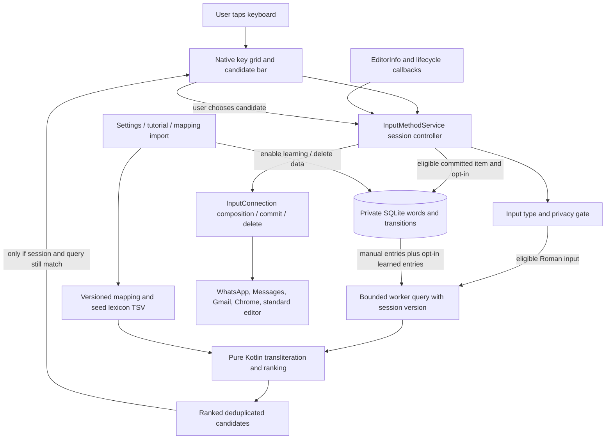

# Architecture and data flow

## Android integration

The keyboard is an `InputMethodService` registered with the input-method intent and metadata, protected by `android.permission.BIND_INPUT_METHOD`. The system binds the service after the user enables and selects it. A launcher/settings activity provides setup, tutorial, practice, and privacy controls. There is no overlay, accessibility service, SMS access, contact access, or background prediction service. This follows the Android IME contract. [Create an input method](https://developer.android.com/develop/ui/views/touch-and-input/creating-input-method).

## Module responsibilities

| Component | Responsibility |
| --- | --- |
| Pure Kotlin engine | Parse bounded data, normalize input, generate mapping candidates, retrieve seed words/prefixes, offer typo and next-word/phrase suggestions, rank deterministically. No Android editor access or network. |
| IME service | Own composition, session context, input-field policy, mode changes, action keys, candidate selection, worker lifetime, and `InputConnection` interaction. |
| Native keyboard views | Show Roman LTR keys and Sindhi RTL candidates; accessible key actions, theme, system keyboard picker, and direct-script pages. |
| Local SQLite repository | Persist manual dictionary entries, opt-in committed word counts, and previous-to-next counts. Keep storage bounded and use parameterized queries; no raw event stream. |
| Settings/tutorial activity | Open system setup, explain input conventions, practice, configure theme/haptic/sound/learning, clear data, and validate/import/reset mappings. |
| Static assets | Reviewed/review-pending mapping rows, seed lexical entries, and small curated phrases. Data are versioned separately from algorithms. |

## Typing transaction

1. `onStartInput` begins a new editor session. Read `EditorInfo` input type/action and privacy flags. Reset composition and prior-session context. Never use another application's previous text as a prediction corpus.
2. Roman key taps update the in-memory Roman buffer and editor composing region. Show the Sindhi output only when there is exactly one distinct eligible exact/mapping output; otherwise preserve the Roman input pending the user's choice. Compute candidate queries from the Roman buffer and the IME's own current-session committed context.
3. Query data/engine on a worker. A monotonically changing query/session identity prevents a slow response from replacing newer candidates or crossing into another field.
4. Candidate labels distinguish dictionary/exact matches, mapping fallback, completion, correction, next word, and phrase. Ambiguous transliteration is visible to the user.
5. Candidate selection commits Unicode text and a trailing space using `InputConnection`. Space/punctuation commits only an unambiguous exact/mapping output, or the original Roman form if ambiguity remains. No correction/completion silently replaces the input or rewrites an earlier word. Details are in [UX](UX.md).
6. Learn only eligible successful commits when the user enabled learning. Discard transient buffers and candidate state when input finishes; cancel or invalidate outstanding work.

Android owns composing spans and editor state. Use `finishComposingText`, `commitText`, deletion APIs, and editor action APIs rather than synthetic letters sent as key events. Special editors still require the compatibility tests. [InputMethodService reference](https://developer.android.com/reference/android/inputmethodservice/InputMethodService).

## Prediction model

Everyday input admits alternative Roman spellings and prioritizes known vocabulary. Strict input uses explicit distinction-preserving tokens; it is a draft project convention pending expert review. Use the mapping specification and TSV headers as the exact format contract.

The MVP combines a draft lexicon, bounded mapping alternatives, prefix lookup, limited edit-distance correction, seed context lookup, and optional local frequency/transition boosts. Deduplicate by normalized output. Ranking scores are heuristics, not calibrated probabilities. Curated phrases are retrieved, not freely generated. An unknown word remains typeable through mapping candidates or literal Roman input; dictionary coverage does not decide whether a key works.

## Privacy boundary

The APK does not declare `INTERNET`, does not include analytics or advertising, and does not schedule background learning or upload jobs. Prediction receives the text the user types through this keyboard, not a dump of the editor. A small amount of text immediately before the cursor may be inspected transiently for safe deletion; it is never retained or used for prediction.

Local learning starts off. When enabled, saved word strings, input aliases, and adjacent-word counts can reveal personal words or phrases; therefore they are disclosed as sensitive local data, not described as anonymous. Explicitly added manual entries remain available with automatic learning off. Password/visible-password/web-password, numeric password, unsuitable structured fields, and editors requesting no personalized learning bypass suggestions and learning. No generic IME can recognize a secret typed into an ordinary unmarked text field; the global learning control remains available. `IME_FLAG_NO_PERSONALIZED_LEARNING` is a platform request that the IME must respect. [EditorInfo reference](https://developer.android.com/reference/android/view/inputmethod/EditorInfo).

The SQLite table stores `mode, roman, text, context, count, manual`; `context` is empty for aggregate word entries and contains the preceding word for a transition. There are no event times or host-app identifiers. Storage is capped at 1,000 rows, prioritizing manual entries and higher counts. Settings can remove an entry and its transitions, clear learned data, or clear all dictionary data. Both clear actions disable learning. The source namespace is `org.sindhipinyin.keyboard`; the development application ID is `org.sindhipinyin.keyboard.dev`.

Private app storage, no automatic cloud backup, and explicit device-transfer exclusions protect dictionary data. `allowBackup=false` alone is not sufficient to assume identical device-to-device behavior on every manufacturer. Audit backup rules and verify Xiaomi restore behavior. Local SQLite is not advertised as independently encrypted. [Android backup guidance](https://developer.android.com/identity/data/autobackup).

## Lifecycle and failure handling

- Cursor moves, selection changes, app switches, sensitive-field transitions, and keyboard mode changes invalidate candidates and stale context. Finishing composition must not duplicate or delete adjacent host text.
- Bound input length, imported file size, row count, candidate count, and mapping branching. Never allow an imported mapping to perform code execution.
- Reject malformed imports before replacing a working mapping; offer reset to the bundled version. Show actionable errors without echoing private editor contents.
- SQLite reads/writes run away from the UI thread. The engine is prewarmed on the worker; a very early first key may synchronously initialize the bounded mapping before prewarming completes. In-memory base candidates run synchronously so rapid space presses use current input. UI callbacks and input-connection operations run on the service's UI thread. Close resources and stop worker work when destroyed.
- No wake lock, alarm, boot receiver, or background polling is required. Keeping an Android process cached is normal and does not itself imply CPU or battery use.
- Receiving apps control their fonts, bidi behavior, and input connections. Use ordinary Unicode letters in logical order; do not reverse text or insert Arabic presentation-form glyphs.

## Upgrade path

Retain the pure engine API and corpus version when changing rankers. Before adding Room, a trie/FST, an n-gram model, or an on-device neural model, measure where time and memory are spent. A data-schema migration must preserve user consent and support clear/delete. Network-based features would require a new privacy design and an updated Play declaration; they are outside this MVP.
